# Schreenshot Showcase
The screenshots below display a fully working version of the Smarthome web-UI.  
The screenshots were taken on Server version `0.2.4`

## Dashboard
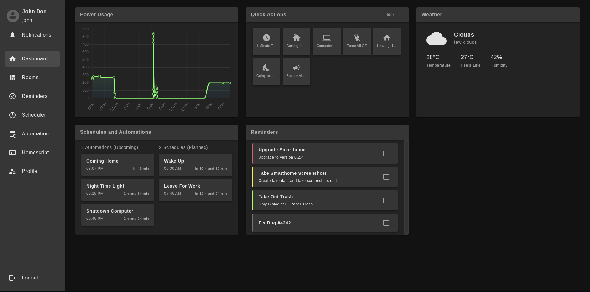
## Rooms
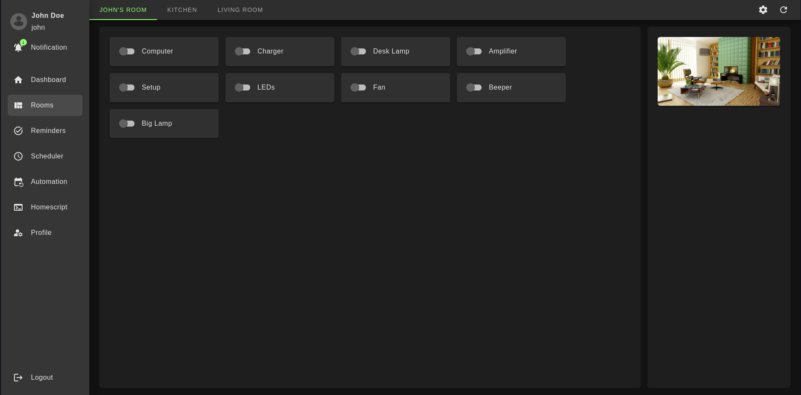
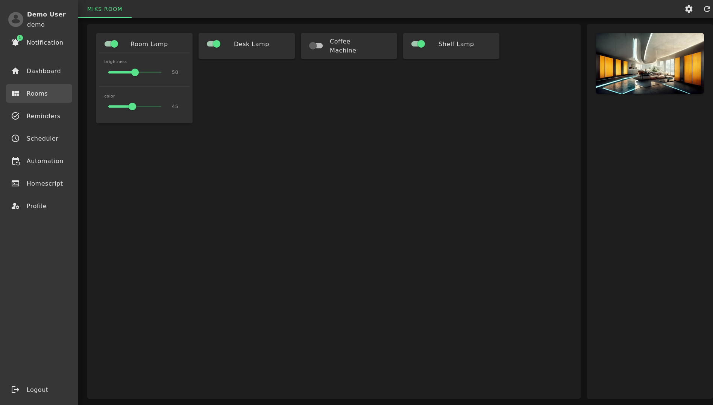
## Automations
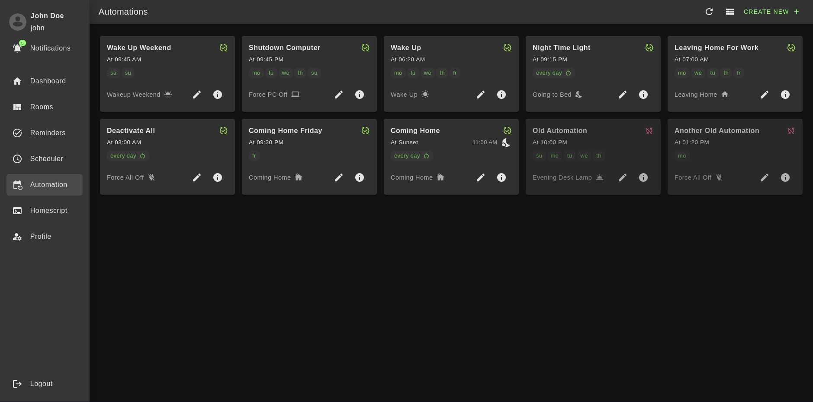
## Reminders / ToDo
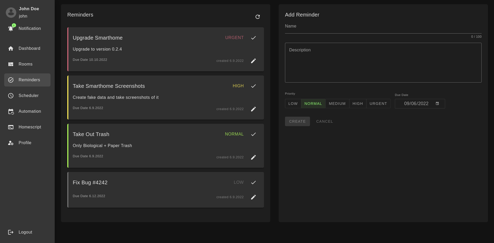
## Homescript Overview
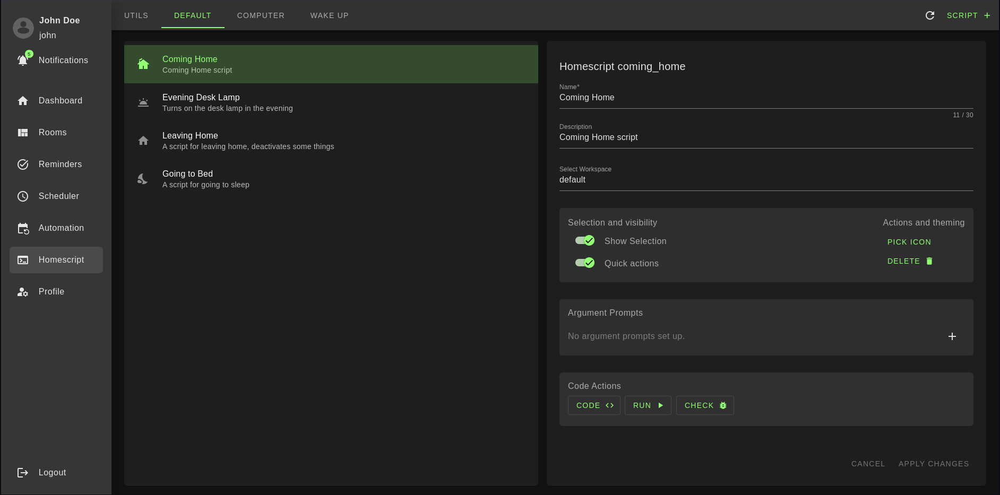
## Homescript Code Editor / IDE
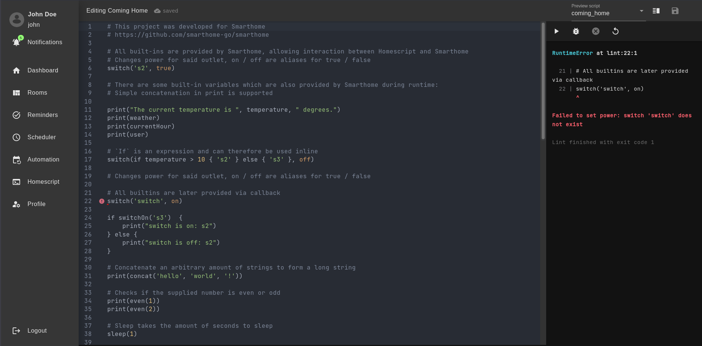
## Scheduler
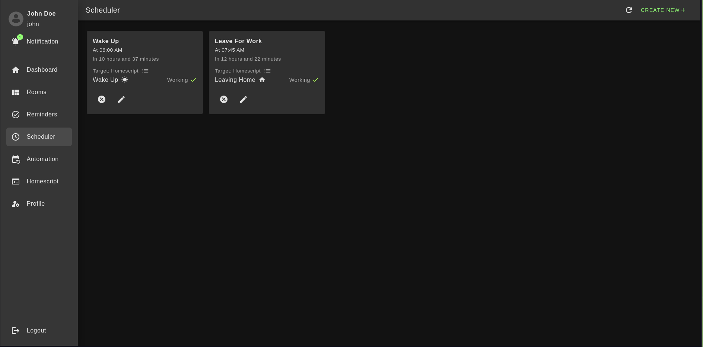
## System Settings
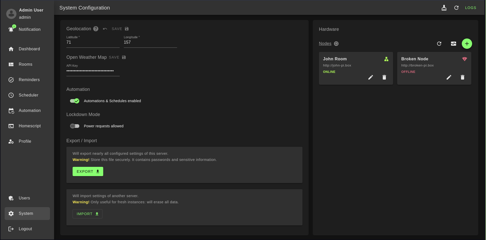
## Login
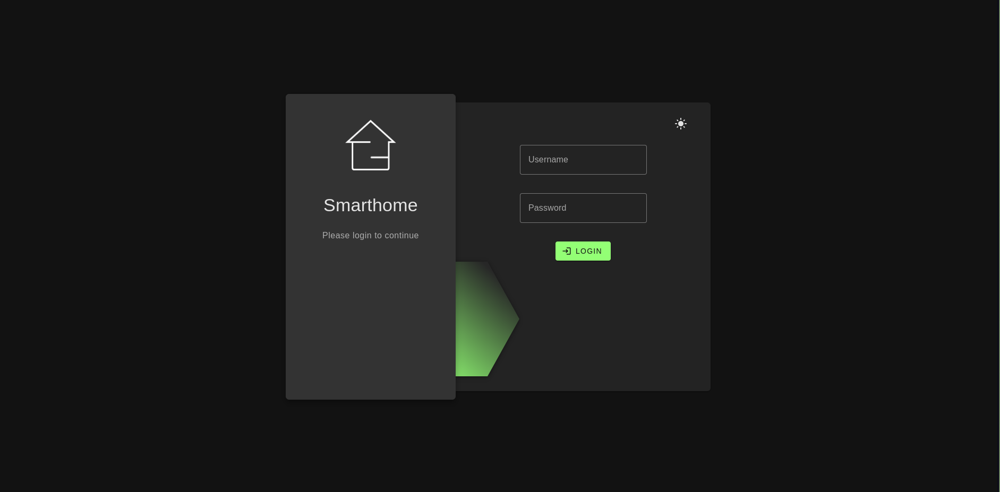
## User & Permissions Management
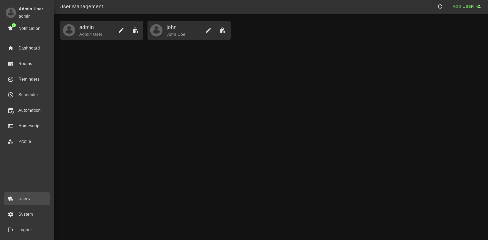
## Personal Profile
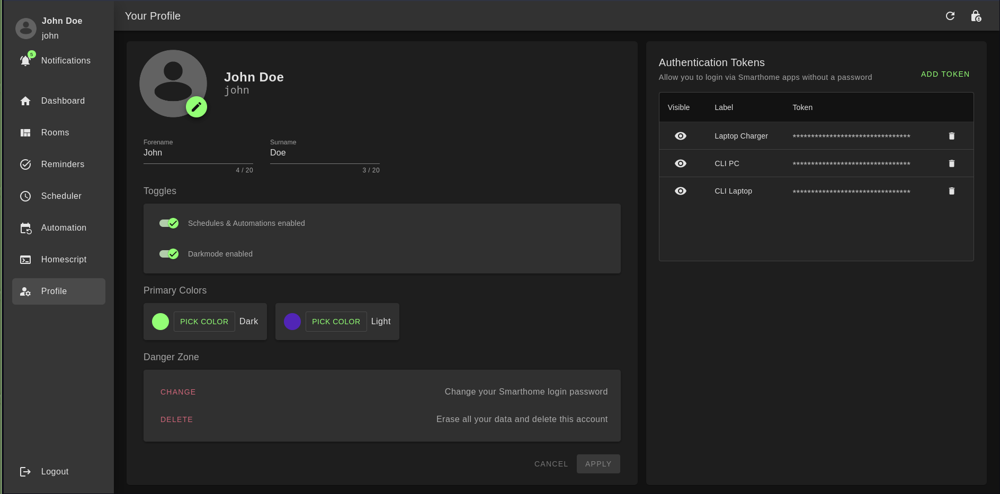
## Personal Profile (*using light mode*)
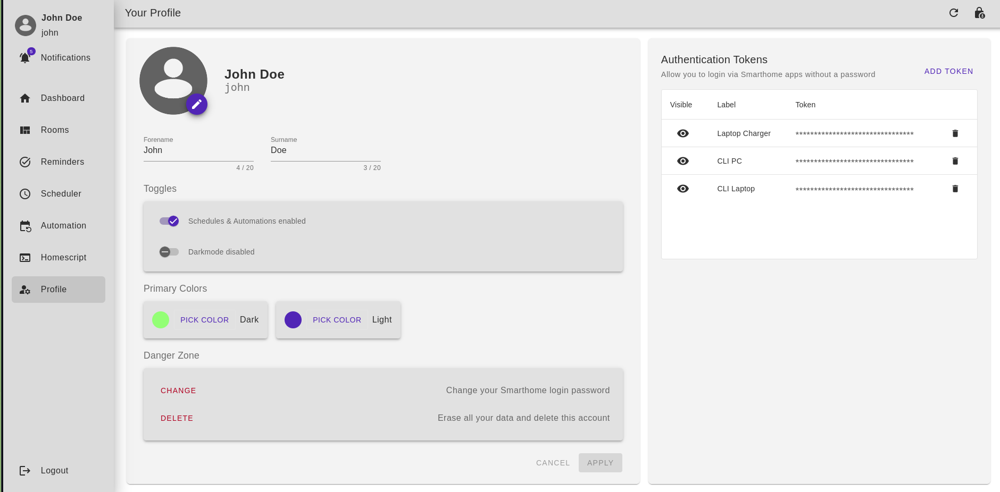
